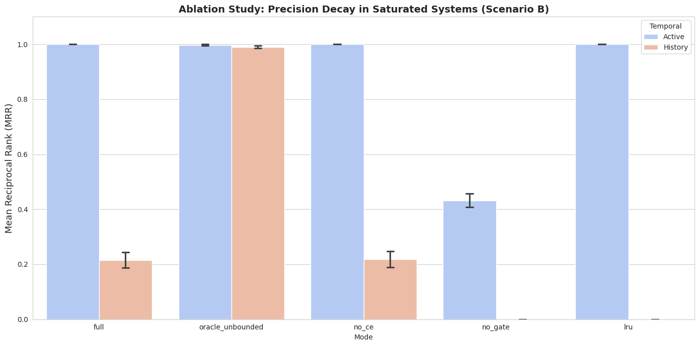

# HTM‑EAR: Hierarchical Tiered Memory with Essential‑Aware Retention

[](LICENSE)

A policy‑driven memory substrate designed to enhance LLM reliability under bounded context constraints.

---

## 📌 Overview

Large Language Models operate under fixed context windows. As long‑running agents accumulate interaction history, naive memory mechanisms suffer from:

- **Context collapse** – losing earlier context as the window fills.
- **Memory saturation** – indiscriminate eviction of facts.
- **Loss of critical historical facts** – important information is forgotten.
- **Precision degradation** – retrieval quality declines under pressure.
- **Latency–accuracy tradeoffs** – naive systems force a choice between speed and recall.

**HTM‑EAR** addresses these challenges through a **hierarchical, policy‑aware memory architecture** that preserves essential information while maintaining retrieval precision and practical latency.

This repository contains:

- A bottom‑up implementation of the HTM‑EAR architecture (`htm_ear.py`)
- Multi‑scenario benchmark suite
- Ablation analysis
- Real‑world log validation (BGL dataset)
- Performance and latency visualization

---

## 🧠 Architecture

HTM‑EAR implements a **two‑tier memory hierarchy**:

| Tier | Role            | Capacity      | Function |
|------|-----------------|---------------|----------|
| L1   | Working Memory  | Bounded       | Holds high‑priority recent facts |
| L2   | Archival Memory | Larger bounded | Stores evicted but retained historical facts |

### Core Design Principles

- **Importance‑aware eviction** – facts are scored by importance (e.g., 0.95 for critical errors, 0.5 for routine logs)
- **Usage‑aware retention** – frequently accessed facts are protected
- **Hybrid neural‑symbolic retrieval** – combines dense embeddings with entity‑based matching
- **Entity‑aware routing** – queries are directed to the correct tier based on entity overlap and similarity
- **Cross‑encoder precision reranking** – optional second‑stage ranking for maximum accuracy
- **Saturation robustness** – explicitly tested under memory pressure

### Eviction Score
score = 0.75 * importance + 0.25 * min(usage / 10, 1.0)

text

When a tier reaches capacity, the lowest‑scoring 15% of items are evicted.

### Retrieval Scoring

Retrieved candidates are scored using:
score = sim³ + 0.8 * entity_overlap + 0.1 * importance

text

This creates a memory system that **actively manages its lifecycle** rather than passively storing vectors.

---

## 🔍 Retrieval Pipeline

HTM‑EAR’s multi‑stage retrieval stack:

1. **Bi‑encoder semantic recall** – fast candidate retrieval from the appropriate tier.
2. **Entity‑aware routing** – if the top L1 candidate has low similarity or missing entities, fall back to L2.
3. **Hybrid scoring** – combine similarity, entity overlap, and importance.
4. **Optional cross‑encoder reranking** – re‑score top candidates for maximum precision.

This architecture balances precision and latency, giving users a knob to trade speed for accuracy.

---

## 🧪 Experimental Evaluation

### Scenarios

| Scenario              | Purpose |
|-----------------------|---------|
| Scenario A: Overflow   | Memory pressure under moderate scale (3,000 facts) |
| Scenario B: Saturation | Long‑term forgetting stress test (15,000 facts) |
| Scenario C: High‑Capacity | Control baseline (5,000 facts) |

### Ablation Modes

| Mode               | Description |
|--------------------|-------------|
| `full`             | Complete HTM‑EAR architecture |
| `oracle_unbounded` | No capacity limit (theoretical upper bound) |
| `no_ce`            | Cross‑encoder disabled |
| `no_gate`          | Tier routing disabled (always stays in L1) |
| `lru`              | Standard Least‑Recently‑Used eviction |

---

## 📊 Saturation Stress Test (Scenario B)

### Precision Decay Analysis

  
*Mean Reciprocal Rank (MRR) for active (blue) and history (orange) queries. Error bars show ±1σ over 5 seeds.*

| Mode              | Active MRR | History MRR | Essential Lost | Pruned Total | Latency (ms) |
|-------------------|------------|-------------|----------------|--------------|--------------|
| **full**          | **1.000**  | 0.215       | **0**          | 9750         | 39.7         |
| lru               | 1.000      | 0.000       | **2416**       | 9750         | 21.1         |
| no_ce             | 1.000      | 0.218       | 0              | 9750         | 20.9         |
| no_gate           | 0.432      | 0.000       | 0              | 9750         | 41.1         |
| oracle_unbounded  | 0.997      | 0.990       | 0              | 0            | 37.4         |

**Key Observations:**

- `full` maintains high active precision and **preserves all essential facts**.
- `lru`, despite identical pruning volume, **destroys >2400 important facts** – proving recency alone is insufficient.
- `no_gate` collapses under saturation, confirming the importance of tier routing.
- Policy‑based retention prevents catastrophic forgetting.

---

## ⚖️ Latency–Precision Tradeoff

  
*Active‑phase MRR against retrieval latency. The shaded red region indicates the “failure zone” (MRR < 0.6).*

The Pareto analysis demonstrates:

- The cross‑encoder increases precision but adds latency.
- `no_ce` provides faster retrieval with minor precision impact.
- LRU achieves speed but at severe retention cost.

This highlights the **controllable system tradeoffs** – users can tune for their latency or accuracy requirements.

---

## 🌍 Real‑World Validation (BGL Logs)

Evaluation on the Blue Gene/L system logs (2,000‑line sample):


| Mode              | MRR    | Latency (ms) |
|-------------------|--------|--------------|
| oracle_unbounded  | 0.370  | 42.0         |
| full              | 0.336  | 42.7         |
| lru               | 0.069  | 22.5         |

**This confirms:**

- HTM‑EAR generalizes beyond synthetic data.
- Importance‑aware retention prevents real‑world degradation (5× better than LRU).
- Performance approaches the unbounded oracle.

---

## 📈 System Robustness Metrics

From Scenario B evaluation (active phase):

| Mode              | Latency (ms) | Essential Lost | Pruned Total |
|-------------------|--------------|----------------|--------------|
| full              | ~39          | 0              | ~9750        |
| no_ce             | ~21          | 0              | ~9750        |
| lru               | ~21          | ~2400          | ~9750        |
| no_gate           | ~41          | 0              | ~9750        |
| oracle_unbounded  | ~37          | 0              | 0            |

**Key Insight:** Essential fact preservation is the defining differentiator of HTM‑EAR over naive eviction strategies.

---

## 🚀 Running the Benchmark

Simply execute:

```bash
python htm_ear.py
```

The script will:

Automatically install missing dependencies (hnswlib, sentence‑transformers, etc.)

Generate synthetic datasets for three scenarios (5 seeds each)

Download a real BGL log sample

Print result tables (MRR, latency, essential loss)

Save the three figures as PNG files

All outputs are printed to the console; figures are saved in the current directory.

🧩 Repository Structure
text
```
HTM-EAR/
│
├── htm_ear.py                 # Core architecture + benchmark suite
├── albratrionScenarioB.png    # Saturation precision analysis figure
├── pareto frontier.png        # Latency–precision tradeoff figure
├── performance BGL.png        # Real‑world validation figure
└── README.md
```
🎯 Design Objective

HTM‑EAR is not a replacement for LLMs. It is a memory substrate designed to enhance:

Long‑running agent stability

Context‑constrained reasoning

Historical recall reliability

Retrieval precision under capacity limits

The architecture is intentionally modular and suitable for integration with:

RAG systems

Tool‑using agents

Log reasoning pipelines

Multi‑session assistants

📌 Contribution Summary
Policy‑driven hierarchical memory architecture

Importance‑aware eviction mechanism

Hybrid symbolic–neural retrieval scoring

Multi‑scenario ablation validation

Real‑world log benchmark evaluation

Latency–precision Pareto analysis

🏗️ Author
Designed and implemented bottom‑up by Shubham Singh.

📄 License
This project is licensed under the Apache License, Version 2.0. See the LICENSE file for details.
